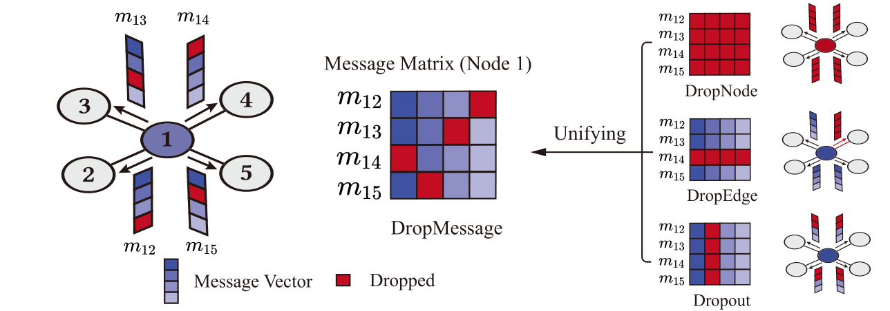

# DropMessage

## About

This project is the implementation of the paper ["DropMessage: Unifying Random Dropping for Graph Neural Networks"](https://arxiv.org/abs/2204.10037).





## Abstract

Graph Neural Networks (GNNs) are powerful tools for graph representation learning. Despite their rapid development, GNNs also face some challenges, such as over-fitting, over-smoothing, and non-robustness. Previous works indicate that these problems can be alleviated by random dropping methods, which integrate augmented data into models by randomly masking parts of the input. However, some open problems of random dropping on GNNs remain to be solved. First, it is challenging to find a universal method that are suitable for all cases considering the divergence of different datasets and models. Second, augmented data introduced to GNNs causes the incomplete coverage of parameters and unstable training process. Third, there is no theoretical analysis on the effectiveness of random dropping methods on GNNs. In this paper, we propose a novel random dropping method called DropMessage, which performs dropping operations directly on the propagated messages during the message-passing process. More importantly, we find that DropMessage provides a unified framework for most existing random dropping methods, based on which we give theoretical analysis of their effectiveness. Furthermore, we elaborate the superiority of DropMessage: it stabilizes the training process by reducing sample variance; it keeps information diversity from the perspective of information theory, enabling it become a theoretical upper bound of other methods. To evaluate our proposed method, we conduct experiments that aims for multiple tasks on five public datasets and two industrial datasets with various backbone models. The experimental results show that DropMessage has the advantages of both effectiveness and generalization, and can significantly alleviate the problems mentioned above.

## Dependencies

`torch==1.10.0`
`torch-geometric==2.0.2`
`torch-cluster==1.5.9`
`torch-scatter==2.0.9`
`torch-sparse==0.6.12`
`torch-spline-conv==1.2.1`
`ogb==1.3.2`

These codes have been tested on the RTX 2080ti with python 3.8 and cuda 11.3.

## Datasets

### Overview

|          | Cora | CiteSeer | PubMed | Flickr | Ogbn-arxiv |
| -------- | ---- | -------- | ------ | ------ | ---------- |
| #node    | 2708 | 3327     | 19717  | 89250  | 169343     |
| #edge    | 5429 | 4732     | 44338  | 899756 | 1166243    |
| #feature | 1433 | 3703     | 500    | 500    | 128        |
| #classes | 7    | 6        | 3      | 7      | 40         |

### Downloads

All these datasets can be downloaded by

`torch_geometric.datasets`

`ogb.nodeproppred.PygNodePropPredDataset`

To run the codes successfully, the downloaded datasets should be placed in `\data`.

## Methods

### Dropout

It has been proposed by ["Improving neural networks by preventing co-adaptation of feature detectors"](https://arxiv.org/abs/1207.0580), which randomly masks some raw features.
$$
\mathbf{\widetilde{X}}_{i,j}=\epsilon \mathbf{X}_{i,j} \quad s.t.\ \epsilon\sim Bernoulli(1-\delta)
$$

### DropEdge

It has been proposed by ["DropEdge: Towards Deep Graph Convolutional Networks on Node Classification"](https://arxiv.org/abs/1907.10903), which randomly masks some edges.
$$
\mathbf{\widetilde{A}}_{i,j}=\epsilon \mathbf{A}_{i,j} \quad s.t.\ \epsilon\sim Bernoulli(1-\delta)
$$

### DropNode

It has been proposed by ["Graph Random Neural Network for Semi-Supervised Learning on Graphs"](https://arxiv.org/abs/2005.11079), which randomly masks some nodes.
$$
\mathbf{\widetilde{X}}_{i}=\epsilon \mathbf{X}_{i} \quad s.t.\ \epsilon\sim Bernoulli(1-\delta)
$$

### DropMessage

We propose DropMessage, which randomly masks some messages during the message-passing process.
$$
\mathbf{\widetilde{M}}_{i,j}=\epsilon \mathbf{M}_{i,j} \quad s.t.\ \epsilon\sim Bernoulli(1-\delta)
$$

## Usage

To train the model on Cora, CiteSeer, and PubMed, you can use the script `train.py`, and its help information is listed as follows:

```
usage: train.py [-h] [-d DATASET] [-c CUDA_DEVICE] [-dr DROPPING_RATE] [-e EPOCH] [-bb BACKBONE] [-dm DROPPING_METHOD] [-hs HEADS] [-k K] [-a ALPHA] [-fyd FIRST_LAYER_DIMENSION] [-r RAND_SEED]

optional arguments:
  -h,  --help            			      show this help message and exit
  -d   --dataset                    The dataset to be trained on [Cora, Citeseer, PubMed].
  -c   --cuda-device                which gpu device to use.
  -dr  --dropping-rate              The chosen dropping rate (default: 0).
  -e   --epoch                      The epoch number (default: 500).
  -bb  --backbone                   The backbone model [GCN, GAT, APPNP].
  -dm  --dropping-method            The chosen dropping method [Dropout, DropEdge, DropNode, 																		 DropMessage].
  -hs  --heads                      The head number for GAT (default: 1).
  -k   --K                          The K value for APPNP (default: 10).
  -a   --alpha                      The alpha value for APPNP (default: 0.1).
  -fyd --first-layer-dimension      The hidden dimension number for two-layer GNNs
                                    (default: 16).
  -r   --rand-seed                  The random seed (default: 0).
```


To train the model on Flickr, you can use the script `train_flickr.py`, and its help information is listed as follows:

```
usage: train_flickr.py [-h] [-c CUDA_DEVICE] [-dr DROPPING_RATE] [-e EPOCH] [-bb BACKBONE] [-dm DROPPING_METHOD] [-hs HEADS] [-k K] [-a ALPHA] [-fyd FIRST_LAYER_DIMENSION] [-r RAND_SEED]

optional arguments:
  -h,  --help            			      show this help message and exit
  -c   --cuda-device                which gpu device to use.
  -dr  --dropping-rate              The chosen dropping rate (default: 0).
  -e   --epoch                      The epoch number (default: 500).
  -bb  --backbone                   The backbone model [GCN, GAT, APPNP].
  -dm  --dropping-method            The chosen dropping method [Dropout, DropEdge, DropNode, 																		 DropMessage].
  -hs  --heads                      The head number for GAT (default: 1).
  -k   --K                          The K value for APPNP (default: 10).
  -a   --alpha                      The alpha value for APPNP (default: 0.1).
  -fyd --first-layer-dimension      The hidden dimension number for two-layer GNNs
                                    (default: 256).
  -r   --rand-seed                  The random seed (default: 0).
```


To train the model on ogbn-arxiv, you can use the script `train_ogb_arxiv.py`, and its help information is listed as follows:

```
usage: train_ogb_arxiv.py [-h] [-c CUDA_DEVICE] [-dr DROPPING_RATE] [-e EPOCH] [-bb BACKBONE] [-dm DROPPING_METHOD] [-hs HEADS] [-k K] [-a ALPHA] [-hd HIDDEN_DIMENSION] [-nl NUM_LAYERS] [-r RAND_SEED]

optional arguments:
  -h,  --help            			      show this help message and exit
  -c   --cuda-device                which gpu device to use.
  -dr  --dropping-rate              The chosen dropping rate (default: 0).
  -e   --epoch                      The epoch number (default: 500).
  -bb  --backbone                   The backbone model [GCN, GAT, APPNP].
  -dm  --dropping-method            The chosen dropping method [Dropout, DropEdge, DropNode, 																		 DropMessage].
  -hs  --heads                      The head number for GAT (default: 1).
  -k   --K                          The K value for APPNP (default: 10).
  -a   --alpha                      The alpha value for APPNP (default: 0.1).
  -hd  --hidden-dimension           The hidden dimension number (default: 128).
  -hl  --num-layers                 The layer number (default: 3).
  -r   --rand-seed                  The random seed (default: 0).
```

### Demo

To apply our proposed DropMessage on these datasets and backbone models, you can directly use the script in `run.sh`

```
sh run.sh
```

## Reference

```latex
@article{Fang2022DropMessageUR,
  title={DropMessage: Unifying Random Dropping for Graph Neural Networks},
  author={Taoran Fang and Zhiqing Xiao and Chunping Wang and Jiarong Xu and Xuan Yang and Yang Yang},
  journal={ArXiv},
  year={2022},
  volume={abs/2204.10037}
}
```

